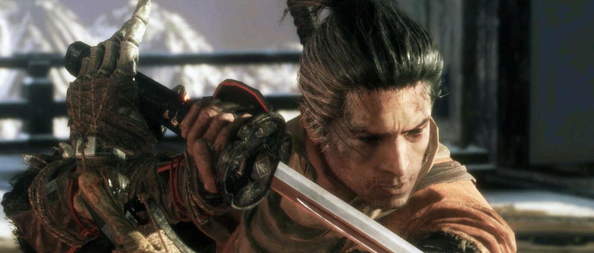

# Sekiro Reinforcement Learning Agent

## Table of Contents
1. [Project Overview](#project-overview)
2. [Installation](#installation)
3. [Project Structure](#project-structure)
4. [Usage](#usage)
5. [Training Process](#training-process)
6. [Customization](#customization)
7. [Checkpointing](#checkpointing)
8. [Contributing](#contributing)
9. [License](#license)
10. [To Do](#to-do)

## Project Overview

This project implements a Deep Q-Network (DQN) agent to play Sekiro: Shadows Die Twice using reinforcement learning. The agent uses a pre-trained ResNet18 (EfficientNet-B0 is also supported) model as its backbone and learns to make optimal decisions in the game environment and we will try to integrate vision transformer/decision transformer in the future.

## Installation

1. Clone the repository:
   ```bash
   git clone https://github.com/yourusername/sekiro_rl.git
   cd sekiro_rl
   ```

2. Install the required dependencies:
   ```bash
   pip install torch torchvision numpy matplotlib
   ```

3. Ensure you have Sekiro: Shadows Die Twice installed and set up for the custom environment.

## Project Structure

- `train.py`: Main script for training the RL agent
- `network.py`: Contains the DQN model architecture
- `env.py`: Custom Sekiro environment (not provided in the snippets)
- `checkpoints/`: Directory for storing model checkpoints

## Usage

To start training the agent, run:

```
python train.py
```

You can customize the training process using various command-line arguments. For example:

```
python train.py --lr 0.0001 --batch_size 128 --epochs 500 --cuda
```

Run `python train.py --help` to see all available options.

## Training Process

The training process involves the following steps:

1. Initialize the Sekiro environment and the DQN model.
2. For each episode:
   - Reset the environment to get the initial state.
   - For each step in the episode:
     - Select an action using an epsilon-greedy policy.
     - Perform the action and observe the next state and reward.
     - Store the transition in the replay buffer.
     - Optimize the model using a batch of experiences from the replay buffer.
   - If the episode is done, move to the next episode.
3. Periodically save checkpoints of the model.

## Customization

You can customize various aspects of the training process:

- Learning rate (`--lr`)
- Batch size (`--batch_size`)
- Number of training epochs (`--epochs`)
- Epsilon values for exploration (`--eps_start`, `--eps_end`, `--eps_decay`)
- Discount factor for future rewards (`--gamma`)
- Checkpoint interval (`--checkpoint_interval`)
- Checkpoint directory (`--checkpoint_dir`)

## Checkpointing

The training process automatically saves checkpoints at regular intervals. Each checkpoint contains:

- Policy network state
- Target network state
- Optimizer state
- Training arguments

You can use these checkpoints to resume training or evaluate the model at different stages of training.

## Contributing

Contributions to this project are welcome! Please follow these steps:

1. Fork the repository
2. Create a new branch for your feature
3. Commit your changes
4. Push to your branch
5. Create a pull request

## License

This project is licensed under the MIT License - see the [LICENSE](LICENSE) file for details.

## To Do

- Implement **behavior cloning** to slightly fine-tune the model before applying heavy reinforcement learning algorithms.
- Collect and preprocess expert gameplay data for behavior cloning.
- Integrate behavior cloning into the training pipeline.
- Experiment with different reinforcement learning algorithms to improve agent performance.
- Add more detailed logging and visualization of training progress.

---

For any questions or issues, please open an issue on the GitHub repository.
